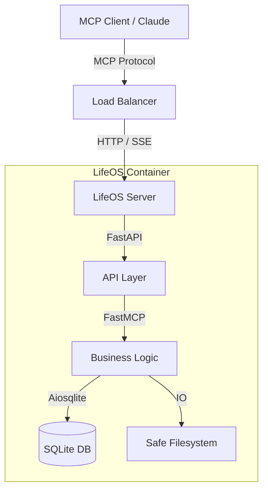
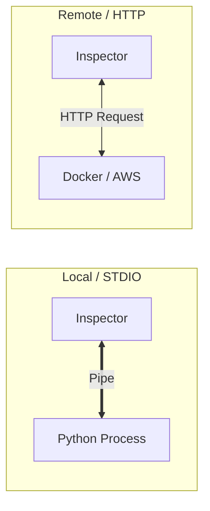

---

```markdown
# LifeOS


<div align="center">

[](https://www.python.org/)
[](https://fastapi.tiangolo.com/)
[](https://www.docker.com/)
[](https://aws.amazon.com/)
[](https://www.sqlite.org/)

**A fast, local-first MCP server backed by SQLite.**
*Manage notes, tasks, calendars, and files securely through Model Context Protocol.*

</div>

---

## 🧠 Core Capabilities

LifeOS exposes a suite of tools for MCP clients (like Claude Desktop), backed by a robust `aiosqlite` database and a safe filesystem layer.

| Domain | Capabilities |
| :--- | :--- |
| **📝 Notes** | Create, list, search, tag, pin, update, delete |
| **✅ Tasks** | Create, update, search, complete, delete, status filtering |
| **📅 Calendar** | Create, list, search upcoming, update, delete events |
| **📂 Filesystem** | Search, list directories, read files (Allowlist protected) |
| **🧩 Resources** | Pre-built prompts and templates for MCP clients |

---

## 📐 Architecture Infographics

### 1. The LifeOS Ecosystem
How the components connect in a production environment.



### 2. Deployment Modes

Choose the setup that fits your workflow.



---

## 🚀 Getting Started

### 1. Local Setup (Project Install)

**Prerequisites:**

* Python 3.12+
* Node 22.7.5+ & npm (for MCP Inspector)

**Installation:**

```bash
# Create and activate virtual environment
python -m venv .venv
source .venv/bin/activate

# Install dependencies
pip install -r requirements.txt

# Configure Environment
cp .env.example .env
# Edit .env as needed. Default SQLite DB path: data/lifeos.db

```

---

## 🛠️ Development & Testing

### 2. MCP Inspector - STDIO (Local)

*Best for rapid development and debugging locally.*

```bash
# Run with Inspector (launches the server)
npx @modelcontextprotocol/inspector -- python -m app.run_mcp --transport stdio

# Test specific tool from CLI
npx @modelcontextprotocol/inspector --cli -- \
  python -m app.run_mcp --transport stdio --method tools/list

```

**Optional Health Check:**

```bash
HEALTH_ENABLED=true HEALTH_PORT=8080 python -m app.run_mcp --transport stdio
# In a separate terminal:
curl -s [http://127.0.0.1:8080/health](http://127.0.0.1:8080/health)

```

### 3. MCP Inspector - HTTP (Remote Simulation)

*Best for testing network connectivity.*

```bash
# 1. Start the Server
python -m app.run_mcp --transport http --host 127.0.0.1 --port 8001

# 2. Start Inspector
npx @modelcontextprotocol/inspector

```

**Inspector UI Settings:**

* **Transport:** Streamable HTTP
* **URL:** `http://127.0.0.1:8001/mcp`

---

## 🐳 Docker Deployment

### 4. Build Image

```bash
docker build -t lifeos-mcp .

```

### 5. Docker + STDIO

Run the containerized server directly via standard input/output.

```bash
npx @modelcontextprotocol/inspector -- \
  docker run --rm -i lifeos-mcp python -m app.run_mcp --transport stdio

```

### 6. Docker + HTTP (Production-ready)

Persist your data using volumes and expose the HTTP port.

```bash
# Create data directory
mkdir -p data

# Run Container
docker run --rm -p 8000:8000 \
  -v $(pwd)/data:/data \
  -e PORT=8000 \
  -e SQLITE_DB_PATH="/data/lifeos.db" \
  -e ALLOWED_BASE_PATHS="/data" \
  lifeos-mcp

```

**Connection:**

* **Inspector URL:** `http://127.0.0.1:8000/mcp`
* **Health:** `http://127.0.0.1:8000/health`

---

## ☁️ AWS EC2 Quick Deploy

Deploy LifeOS to the cloud for 24/7 availability.

1. **Launch EC2:** Ubuntu 22.04 LTS.
2. **Security Group:** Open ports `22` (SSH) and `8000` (MCP HTTP).

**On the Server:**

```bash
# 1. Install Docker
sudo apt-get update
sudo apt-get install -y docker.io
sudo usermod -aG docker $USER
# Log out and back in to apply group changes

# 2. Setup Project
git clone <YOUR_REPO_URL>
cd LifeOS

# 3. Build & Run
docker build -t lifeos-mcp .
mkdir -p /data/lifeos

docker run -d --name lifeos-mcp -p 8000:8000 \
  -v /data/lifeos:/data \
  -e PORT=8000 \
  -e SQLITE_DB_PATH="/data/lifeos.db" \
  -e ALLOWED_BASE_PATHS="/data" \
  lifeos-mcp

```

**Verify Deployment:**

* Local check: `curl -s http://127.0.0.1:8000/health`
* Remote Inspector: Connect to `http://<EC2_PUBLIC_IP>:8000/mcp`

> ⚠️ **Security Tip:** Restrict your AWS Security Group inbound rules for port 8000 to your specific IP address to prevent unauthorized access.

```

```